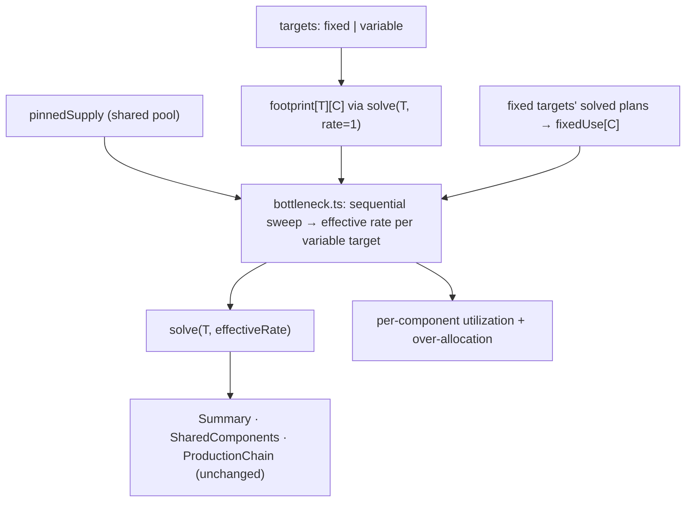

# Variable targets & bottleneck reflow — design

**Date:** 2026-06-25
**Status:** Draft for review
**Area:** `dsp-helper` calculator (engine + React UI)

## Problem

Today the calculator solves strictly **top-down**: the user fixes a target item and
rate, and the engine recurses through ingredients computing each one's required
throughput, with raw/mined resources surfacing at the leaves. There is no way to
express the inverse, real-world question a player actually has:

> "My supply of *this component* is the bottleneck. Given that ceiling, how much
> final product can I make — and if I'm making several things, how do they share
> the constrained supply?"

We want to let the user **pin the available rate of one or more components** (raw
*or* intermediate) and mark one or more targets as **Variable**, so production
*reflows* from the bottleneck up to the targets. When multiple variable targets
compete for the same pinned supply, the allocation is speculative, so we expose it
as **coupled sliders** over a shared, fixed supply pool.

## Key enabling insight: the chain is linear in the target rate

Every per-node quantity the solver computes — `craftsPerSecond`, `machinesNeeded`,
`powerKW`, child ingredient rates, proliferator sprays, raw amounts — is a direct
linear multiple of the node's incoming `ratePerSecond`. The proliferator
multipliers (`recipe-runtime.ts`) depend only on the recipe / machine / graph,
never on the rate. Cycle-breaking is path-dependent, not rate-dependent. The
integer-ratio scaling (`computeIntegerRatios`) is a *post-solve display* concern
and never feeds back into the base plan.

**Therefore** a target's *footprint* on a component — how much of component `C` it
consumes per **1 unit/s** of target output — is a **rate-independent constant**,
exactly measurable with a single solve at `rate = 1`. This reduces the whole
feature to a small **linear allocation** problem layered on top of the unchanged
solver. (Verified against `solver.ts` and `recipe-runtime.ts`.)

## Scope

In scope:

- Mark any target Fixed (today's behavior) or **Variable**.
- A shared **"Available supply"** pool: component id → available rate. Components may
  be raw/mined **or** intermediate.
- **Coupled sliders** for variable targets that divide the remaining pool, with a
  deterministic, globally-feasible allocation.
- Per-component **utilization bars** with an over-allocation (red) signal.
- **Inline pinning** from a production-chain node, writing into the shared pool.
- Persistence (setups + share URLs) and i18n.

Out of scope (explicitly):

- Byproduct crediting (the engine does not credit byproducts today; this feature
  inherits that limitation — see Limitations).
- A true LP optimizer that *maximizes* total output across variable targets. We use
  a deterministic greedy sweep in user-visible target order instead, which matches
  the "drag a slider, watch the others shrink" interaction the user asked for.
- Reordering targets to change allocation priority (priority = current target order).

## Semantics (precise)

- **Pinning a component `C` at supply `S_C`** means: *the total consumption of `C`
  across the whole plan must not exceed `S_C`.* It is a **throughput ceiling**.
  Pinning an *intermediate* does **not** mean "I have `C` from elsewhere, stop
  building its inputs" — the chain still builds `C` from scratch (its sub-tree is
  fully included and continues to scale). The UI copy must make this explicit.
- **Fixed targets** are hard requirements and draw from the pinned pool **first**.
- **Variable targets** divide whatever supply remains.
- If fixed targets alone exceed a pinned supply, the component is **over-allocated**:
  flag it (red / `text-amber`) but still compute.

## Architecture

Three layers, mirroring the existing decoupling. The pure engine gains one new
module; the React hook gains state + a derived pipeline; the UI gains three
surfaces.



### Layer 1 — pure engine: `src/calculator/bottleneck.ts`

No React. Vitest-covered. Mirrors `shared-components.ts` conventions.

**Footprint extraction.** A helper walks a solved plan tree and returns
`Map<componentId, ratePerSecond>` = the sum of `ratePerSecond` across every node
whose `item === componentId`, **excluding the plan's root node**. The root node's
rate is the *delivered output*, not internal consumption; skipping it makes the map
mean exactly "consumption of `C`," which is what the `consumption ≤ S_C` semantics
require. (For an intermediate `C` the root is never `C` anyway; the exclusion only
matters when `C` equals the target's own output item — a case also blocked by the
pin/target guard below.) Used two ways:

- For a **variable** target: solve at `rate = 1`, extract → `footprint[T]`
  (rate-independent; memoized in the hook).
- For a **fixed** target: extract directly from its already-solved real plan →
  contributes to `fixedUse` (no extra unit-solve needed).

Summing over all matching nodes is correct when `C` appears at multiple nodes, and
yields independent, non-double-counted constraints for nested pins (a pinned `C`
whose sub-tree contains a pinned `D`): `C` and `D` are distinct ids, each measured
on its own.

**Proliferator items are not footprint-measurable.** The solver accounts for spray
usage only as the scalar `proliferatorSpraysPerSecond`; proliferator items never
appear as ingredient/tree nodes, so a footprint walk returns 0 for them. Pinning a
proliferator item is therefore **disallowed** (the supply-panel picker excludes
proliferator items). This avoids a falsely-"unbounded" target that actually
consumes the pinned item.

**Allocation — deterministic sequential sweep.**

```
inputs:
  pinned:    Map<C, S_C>                  // available supply, items/s
  fixedUse:  Map<C, number>               // Σ over fixed targets of consumption of C
  variable:  [{ target, footprint: Map<C, number>, intent: number }]  // in target order

avail[C]      = S_C − fixedUse[C]         // may be < 0 (over-allocated)
remaining[C]  = avail[C]                  // running pool, mutated through the sweep

for each variable target T, in target order:
  constraints = { C : footprint[T][C] > 0 }
  if constraints is empty:
      // T is not bounded by any pinned component
      effective[T] = intent[T]            // free; UI shows a numeric input, not a slider
      // (no decrement; T does not touch the pool)
  else:
      headroom[T]  = min over C in constraints of  max(0, remaining[C]) / footprint[T][C]
      effective[T] = clamp(intent[T], 0, headroom[T])
      for C in constraints: remaining[C] -= footprint[T][C] · effective[T]

output per variable target: { effectiveRate, sliderMax = headroom[T], bounded: constraints≠∅ }
  // for an unbounded target, sliderMax is reported as null/undefined (NOT ∞); see init rule below
output per pinned component:
  { supply, fixedUse, variableUse = Σ effective·fp, total = fixedUse+variableUse,
    free = max(0, supply − total), overAllocated = total > supply + ε }
  // `free` is clamped at 0 so the utilization bar never renders a negative segment
```

**Why a sweep, not an independent per-target `min`.** An independent
"max given all others' current values" formula only guarantees *pairwise*
feasibility; with ≥3 targets sharing ≥2 components the sum can still exceed a
supply. The running-`remaining` sweep subtracts each target's draw before the next,
so `Σ effective·footprint ≤ avail[C]` holds **globally**. Verified with a
3-target / 2-component example:

> C1 avail 100, C2 avail 100. T1 fp=(2,1), T2 fp=(1,2), T3 fp=(1,1), all intent=∞.
> Sweep: T1 → min(50,100)=50, remaining=(0,50); T2 → min(0,25)=0; T3 → min(0,50)=0.
> Totals C1=100≤100, C2=50≤100. Feasible.

The sweep is a **pure function** of `(intents, footprints, avail, order)` → fully
deterministic, no oscillation when a drag re-runs it. Lowering an earlier target's
intent frees `remaining` that later targets immediately see.

### Layer 2 — React hook: `src/web/hooks/useCalculator.ts`

`CalcTarget` gains a discriminant:

```ts
type CalcTarget = {
  id: string; item: string; unit: TimeUnit;
  mode: 'fixed' | 'variable';
  amount: number;   // fixed: the hard rate (today). variable: the user's slider/intent value.
};
```

New global state — the shared supply pool:

```ts
pinnedSupply: Record<string, { amount: number; unit: TimeUnit }>;  // componentId → available rate
```

Plus actions: `setTargetMode`, `setPinnedSupply(componentId, amount, unit)`,
`removePinnedSupply(componentId)`.

All rates inside this pipeline and `bottleneck.ts` are in **items/s**. Conversion
to/from each target's or pinned row's display unit (via `UNIT_SECONDS`) happens
only at the UI boundary; `sliderMax` is converted back to the target's unit for the
slider, and the user's intent is stored consistently. The pure module is
unit-agnostic — keep all unit math out of it to avoid 60×/3600× errors.

**Derived pipeline (all `useMemo`):**

1. Solve **fixed** targets at their real rate (today's path). Solve **variable**
   targets at `rate = 1` for footprints. Footprints are memoized per target on
   `(item, machineOverrides, proliferator, machineTiers, recipeOverridesByTarget[id])`
   — note the **per-target** recipe-override slice, not the global record — i.e.
   everything that changes the chain shape **except** the slider value, so dragging
   a slider does **not** recompute footprints.
2. `computeAllocation(...)` (the sweep) → per-variable-target `effectiveRate` +
   `sliderMax`, per-component utilization. Cheap arithmetic; recomputes live on a
   drag for the numeric effective-rate readouts and the utilization bars.
3. Solve each variable target at its `effectiveRate` → a standard `ProductionPlan`.
   **Downstream `Summary`, `SharedComponents`, and `ProductionChain` are unchanged**
   because they consume plans. **This step is NOT cheap:** `effectiveRate` changes
   every drag frame, so a literal implementation re-runs `solve()` for each variable
   target plus `combinePlans` / `buildSharedComponents` / integer-ratio collection
   per frame. To keep dragging smooth, the **full re-solve (step 3) and the
   downstream rollups are debounced / deferred to pointer-up**; during an active
   drag only step 2's numbers update live. (Earlier drafts wrongly called drags
   fully cheap — only steps 1–2 are.)

The `solved` list must gate variable targets on `effectiveRate > 0` (not on the
stored `amount`/intent), so a clamped-to-0 variable target is correctly omitted and
an unbounded target with intent 0 behaves consistently. Recipe-less (raw/mined)
items have no chain to reflow, so **Variable mode is disabled for them** (they are
filtered by `graph.itemToRecipe.has` today).

**Initialization & clamping.** Switching a *bounded* target to Variable sets its
`amount` (intent) to the current `sliderMax` **once** (Q6 = "start at max"). For an
**unbounded** target (`sliderMax` is null) we do **not** write `sliderMax` —
initialize from the target's prior finite `amount` (or a sensible default), never
`Infinity`, so downstream `solve()` never receives `Infinity`. Thereafter `amount`
is the stored intent; the **effective** rate is the sweep's clamped output. We never
mutate `amount` to clamp it (avoids a reactive feedback loop); the slider renders
the effective value while preserving the stored intent.

**Persistence.** Carry `mode` on each snapshot target object — extend
`SnapshotTarget` to `{ item, amount, unit, mode }` rather than adding a separate
parallel `targetModes` array. This is deliberate: `sanitizeSnapshot` **drops**
targets whose item fails validation, so a parallel top-level array would desync;
mode-per-target rides along with `recipeOverrides`, which is already pushed inside
the same loop. Add `pinnedSupply` as a new top-level field. Versioning, explicitly:

- `SetupSnapshot.v` bumps to **2**. `getSnapshot` emits `v: 2`. `StoredSetups.v`
  (the *container* version in `loadStoredSetups`) is a separate number and stays
  **1** unless the container shape itself changes — it doesn't here.
- `decodeSetupUrl` and the snapshot path in `loadStoredSetups` must accept
  `v === 1 || v === 2` (currently hard-reject `!== 1`). A `v: 1` payload is a valid
  v2 with all targets Fixed and an empty pool.
- `sanitizeSnapshot` returns `v: 2`; validates each target's `mode` against the
  `'fixed' | 'variable'` enum (default `'fixed'`); validates `pinnedSupply` keys via
  `isValidItem`, drops unknown/proliferator ids, and clamps amounts to finite `≥ 0`.
  Missing fields on a v1 payload default to Fixed / empty pool.

### Layer 3 — UI surfaces (`src/web`)

1. **Target row** (`App.tsx`): a Fixed/Variable toggle. Fixed → today's numeric
   input. Variable → a **slider** `0 … sliderMax` with the resolved effective rate
   shown numerically beside it in the display unit. A variable target that is
   **unbounded** (touches no pinned component) shows a plain numeric input plus a
   short notice ("not limited by any pinned supply").

2. **"Available supply" panel** — a new `Section` below Targets and the source of
   truth for the pool. Rows of *component picker + rate + unit*. Per pinned
   component, a **utilization bar** segmented `fixed use | variable use | free`,
   using `text-amber` (the project's warning token — there is no red token) when
   `overAllocated`; the `free` segment is clamped at 0.

   **Pin/target guard (bidirectional).** A pinned component may not be **any current
   target's output item** (fixed or variable), and conversely an item that is a
   current target's output cannot be added to the pool — the picker excludes such
   items and adding/marking is blocked. This prevents the nonsensical "output
   constrained by its own pin" self-coupling in both directions. Proliferator items
   are likewise excluded (see Layer 1).

3. **Inline pin** (`ProductionChain.tsx` node): a small "limit" affordance that
   writes the node's item + current rate into `pinnedSupply` (Q4 = "both"). One
   source of truth — editing in either place reflects in both. Copy clarifies it
   sets a **throughput ceiling**.

All new display strings go through `react-i18next` (`en` source of truth, `zh`
parity-typed). Colors via semantic classes only; always-dark; UI primitives from
`src/web/ui/`.

## Testing

- **`bottleneck.test.ts`** (Vitest, pure): footprint extraction (single node,
  multi-node, nested pins, raw vs intermediate; **root-node excluded**); the sweep's
  global feasibility for ≥3 targets / ≥2 components; determinism; unbounded-target
  fallback (`sliderMax` null, no `Infinity`); `avail < 0` and `S_C = 0`;
  freed-headroom-after-lowering-an-earlier-target; `free`-segment clamped at 0.
- **Persistence tests** (extend setups tests): a real `v: 1` snapshot/URL loads as
  all-Fixed + empty pool; a `v: 2` round-trips; `sanitizeSnapshot` drops an unknown
  pinned id, a proliferator pinned id, and an invalid `mode`; target-mode stays
  aligned when an unknown-item target is dropped.
- Existing `solver.test.ts` must stay green (engine unchanged).
- `npx tsc -b` and `npm test` before done.

## Known limitations (documented, by design)

- **No byproduct credit.** Footprint is *gross* consumption; if `C` is produced as a
  byproduct elsewhere, it is not netted off. Matches the existing engine.
- **Proliferator items cannot be pinned.** Spray consumption is a scalar in the
  solver, invisible to the footprint walk, so proliferators are excluded from the
  supply pool (see Layer 1).
- **Dragging fully reflows only on pointer-up.** During an active drag the effective
  rate and utilization bars update live, but the per-target chain re-solve and the
  combined rollups are deferred to pointer-up to keep dragging smooth (see Layer 2,
  step 3).
- **Greedy priority = target order.** Earlier targets claim the shared pool first;
  this is not a global throughput optimizer. Intentional, matches the requested
  slider interaction.
- **Adding a second variable target when the first already claims the whole pool**
  initializes the second at `0` (start-at-max + coupling). Expected; the user pulls
  the first down to make room.

## Open decisions deferred to implementation

- Exact placement/visual of the inline pin affordance within a chain node.
- Whether the slider snaps to "nice" rates or stays continuous.

## Review note

The load-bearing correctness claims here (linearity → footprint constancy; the
sweep's global feasibility) were adversarially reviewed twice: once by the author
against the solver code, and once by an independent reviewer subagent that read the
solver, `recipe-runtime`, `shared-components`, `useCalculator`, and `setups` in full.
Both confirmed the linearity and global-feasibility claims (the reviewer could not
construct a feasibility counterexample). The reviewer's integration/persistence
findings — per-drag re-solve cost (now debounced), proliferator footprint blind spot
(pins excluded), `Infinity` init for unbounded targets (finite-init rule),
`targetModes` desync (mode-per-target object), v1→v2 version-gate gaps (gates accept
both), bidirectional pin/target guard, root-node exclusion, per-target memo key,
unit handling, and the `text-amber` token — are all folded into the sections above.
