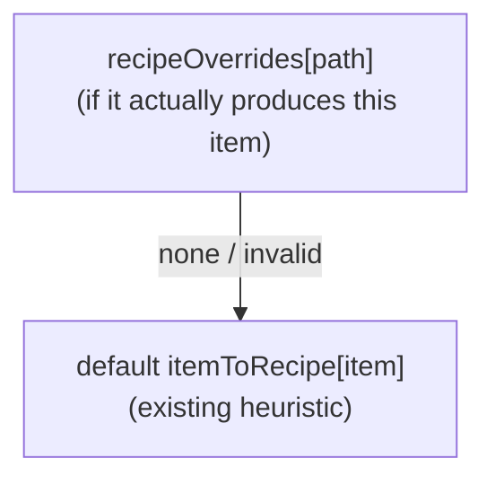

# Per-occurrence recipe selection

**Date:** 2026-06-20
**Status:** Approved design — pending implementation plan
**Area:** `src/calculator` (engine) + `src/web` (calculator UI)
**Supersedes:** the abandoned "multi-recipe splitting" feature (archived at git tag
`archive/recipe-splitting`); `main` was reset to `616fc27` before this work.

## Problem

Several DSP items can be produced by more than one recipe (e.g. **Deuterium** via
the *Fractionator* vs. the *Particle Collider*; **Sulfuric Acid** from an ocean
vein vs. the chemical-plant craft; **Diamond** from graphite vs. kimberlite). The
calculator picks **one** "primary" recipe per item via a fixed heuristic in
`buildRecipeGraph` (`itemToRecipe`), and the user cannot change it.

An earlier attempt let users *split* an item's output across multiple recipes.
That proved unintuitive. This feature replaces it with the simpler, expected
interaction: **let the user pick one alternate recipe for a node**, and that
recipe — together with its whole input sub-tree — replaces the default for that
node. It parallels the existing per-item *machine* override exactly.

## Goals

- At any chain row whose item has more than one producing recipe, show a **recipe
  dropdown** listing every recipe that makes it (advanced/excluded variants
  included), and let the user pick one.
- The chosen recipe drives the node's machine options, its inputs (children), and
  whether the node is a raw/mined leaf.
- The choice is **per-occurrence** (this node and its sub-tree only), keyed by the
  node's path in the tree.

## Non-goals

- **No splitting** across recipes, **no** "production excess", **no** "apply
  everywhere"/global scope, **no** persistence. These were deliberately dropped
  for simplicity.
- **Byproducts / co-products remain unmodeled** (pre-existing limitation).
- No change to the research-tree or item-lookup tabs.

## Domain model

### Recipe resolution per node

For each node the solver picks its recipe as:



- `recipeOverrides` is keyed by the node's **path**: the chain of item ids from
  the root joined with `>` (root path = the target item id, child path =
  `${path}>${ingredientId}`). This mirrors the per-item `machineOverrides` model
  but scoped to a tree position rather than an item id.
- An override is honored only when the referenced recipe exists and lists this
  item in its outputs; otherwise the node falls back to the default. When an
  ancestor's recipe changes, deeper path keys may no longer match — those
  overrides are silently ignored (graceful), never an error.
- The chosen recipe determines everything downstream: machine producers, the
  `mined` flag (from the recipe's `mining` flag), and the children.

## Engine changes (`src/calculator`)

`ProductionNode` is unchanged (single `recipe` / `machine` / `children`). No
`branches[]`.

### `recipe-graph.ts`

- Add `recipeById: Map<string, Recipe>` — **all** recipes by id, including
  excluded variants, so an override can resolve any recipe.
- Add `recipesFor(itemId): Recipe[]` — every recipe that produces the item,
  **default recipe first**, no duplicates; `[]` for an unknown item. Drives the
  picker.

### `solver.ts`

- `solve()` / `solveNode()` gain a `recipeOverrides?: Record<string, string>`
  table and the node **path** (root call passes the target item id; each child is
  recursed with `` `${path}>${ingredient.id}` ``).
- Recipe selection inside `solveNode`:

  ```ts
  const overrideId = recipeOverrides?.[path];
  const override = overrideId ? graph.recipeById.get(overrideId) : undefined;
  const recipe =
    override && override.out.some((o) => o.id === itemId)
      ? override
      : graph.itemToRecipe.get(itemId);
  ```

- **`mined` comes from the chosen recipe** (`recipe.flags.includes('mining')`)
  rather than the global `minedResources` set, so an override to a mining recipe
  makes the node a raw leaf while a craft recipe drills into ingredients. (For the
  default recipe this is equivalent to today's behavior — a mined item's primary
  recipe carries the `mining` flag.)
- **Machine-override validity guard:** apply the per-item machine override only
  when that machine is actually a producer of the chosen recipe; otherwise fall
  back to the tier/default machine:

  ```ts
  const machine =
    (overrideId2 && recipe.producers.includes(overrideId2)
      ? graph.machineById.get(overrideId2)
      : undefined) ??
    tierMachine(graph, recipe, machineTiers) ??
    graph.defaultMachine(recipe);
  ```

  (`overrideId2` = `machineOverrides?.[itemId]`.) This prevents a stale machine
  from sticking to a freshly-chosen recipe. For the default recipe it is a no-op,
  since the machine dropdown only ever offers that recipe's producers.
- Everything else (proliferator effect, machine/power/sprays math, cycle guard by
  item id, roll-up callbacks) is unchanged.

### Tests (`solver.test.ts`, `recipe-graph.test.ts`)

- `recipesFor` lists all producers default-first, no duplicates, `[]` for unknown;
  `recipeById` resolves excluded recipes.
- An override switches the recipe used → different machine and different inputs
  (e.g. Deuterium overridden to the Particle Collider recipe).
- A mining override turns the node into a raw resource (added to `rawResources`,
  no children) while the default craft recipe drills down.
- An invalid override (unknown recipe, or one that doesn't produce the item) is
  ignored → default used.
- A per-path override does not affect the same item at a different path.
- Existing tests still pass (the new `recipeOverrides` arg is optional/trailing).

## State (`src/web/hooks/useCalculator.ts`)

- Add `recipeOverrides: Record<string, string>` (path → recipeId), **in-memory**,
  reset to `{}` whenever `targetItem` changes — the same lifecycle as the existing
  `machineOverrides`.
- Setter `setRecipeOverride(path: string, recipeId: string | null)` — sets the
  override, or deletes it when `null` (back to default).
- Thread `recipeOverrides` into the `solve(...)` call and the memo deps.

## UI (`src/web/components/ProductionChain.tsx`)

- Thread a `path` prop down the tree (root = `node.item`, child =
  `${path}>${child.item}`).
- In each row, when `graph.recipesFor(node.item).length > 1`, render a **recipe
  dropdown** immediately to the left of the existing machine dropdown. It lists
  every recipe from `recipesFor` (default first), labelled via `recipeName`, with
  the current recipe (`node.recipe.id`) selected. Choosing one calls
  `onRecipeChange(path, recipeId)`. Single-recipe rows are unchanged.
- The machine dropdown continues to read `node.machine` and lists
  `graph.producersFor(node.recipe)` — so it automatically reflects the chosen
  recipe's producers.
- New i18n keys (en source of truth, zh parity) for the recipe control's
  label/aria (e.g. `chain.recipe`).

```
Single-recipe row (unchanged):
[v] [Cu] Copper Ingot   60/min   [Smelter ▾]  ×2

Multi-recipe row (recipe dropdown added, left of machine):
[v] [Dt] Deuterium  120/min  [Fractionation ▾] [Fractionator ▾] ×4
                                 ↑ recipe          ↑ machine
```

## Edge cases

- **Mining override** → node becomes a raw leaf (no children); the machine
  dropdown shows the mining machine producers.
- **Stale override** after an ancestor recipe change → path no longer matches →
  silently ignored, default used.
- **Override recipe that no longer produces the item** (hand-state) → ignored.
- **Cycle items** (e.g. hydrogen ↔ deuterium) keep the existing visited-set break
  by item id.

## Testing

- `npm test` — extended `solver.test.ts` / `recipe-graph.test.ts` above.
- `npx tsc -b` clean; `npm run build` succeeds.
- Manual: target Deuterium, switch its recipe to *Particle Collider* and confirm
  the machine, inputs (Hydrogen rate), buildings, and power update; switch
  Sulfuric Acid to the ocean vein and confirm it becomes a raw resource.
